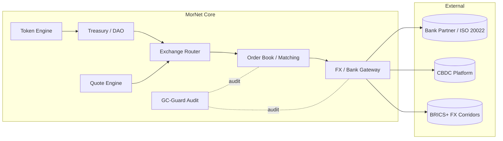
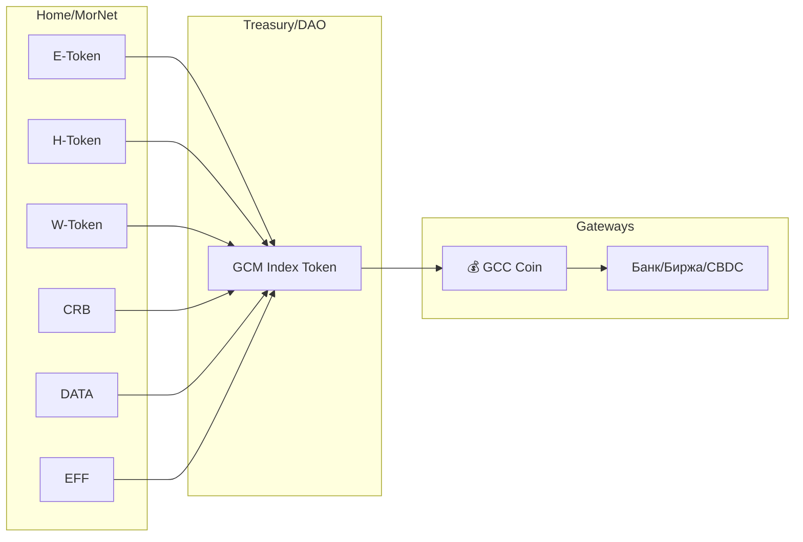
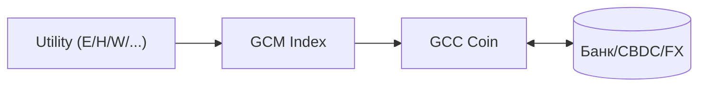

# MorNet / GreenCore — Проектный протокол и архитектура v1.4.0

**Дата:** 15.10.2025

**Горизонт:** до января 2026

**Назначение документа:** единая точка ориентира для всей команды (дизайнеры, инженеры, программисты, блокчейн, архитекторы, преподаватели, финансисты, туроператоры, банк‑партнёры, бухгалтерия, юристы, DevOps, руководство).

---

## 1) Краткое описание инициативы

**Что делаем:** ядро морфогенетической сети (MorNet) для экосистемы GreenCore: учёт энергии (kWh‑only), токенизация (E‑Token, далее — «E»), внутренний индекс‑токен **GCM**, казначейство/распределение, обменник, шлюз банка/ЦФА/CBDC, правовой контур **GC‑Guard**, публичные и административные интерфейсы.

**Для кого:** пользователи, инвесторы, операторы объектов, регионы и банк‑партнёры.

**Результат:** прозрачная экономика кластера (энергия → токен → сервис → отчётность), готовая к пилоту и масштабированию.

---

## 2) Объём первой версии (MVP, kWh‑only)

- Сбор **только kWh** интервалов 15 минут от Electrostation Node (виртуальные/реальные).
- Расчёт **E_netWh** (приоритет: boundary meter; fallback: gen−aux−loss×k_safety).
- **Mint E‑Token** (ERC‑1155 batch per interval), учёт в казначействе DAO Treasury.
- **GCM** как внутренний индекс‑токен (учёт/расчёты внутри платформы).
- **Обменник**: базовые пары (E↔GCM, GCM↔фиат через банк‑шлюз).
- **GC‑Guard**: KYC/KYB/AML, журналы, политики минта/резервов, MRV‑отчёты.
- **UI**:
    - Admin App (Vue 3 + Naive UI): станции, токены, казначейство, GC‑Guard.
    - Public App (React + Next.js): кабинет инвестора/пользователя, витрины, DAO.
- **Demo/Live Switch**: переключение виртуальной телеметрии на реальную (REST + Modbus TCP/RTU).

---

## 3) Архитектура (высокоуровнево)

- **Frontend (гибрид):**
    - **Admin (Vue 3 + Naive UI)** — закрытый контур: операционные панели, казначейство, GC‑Guard.
    - **Public (React + Next.js)** — публичный контур: кабинет, маркетплейс/NFT, DAO, SSR/SEO.
- **API Gateway:** REST/gRPC, auth, rate‑limit, валидация (Zod), OpenAPI.
- **Core Services (NestJS):** Identity/SSO, Wallet, Token Engine, DAO Treasury, Exchange Router, Bank/CBDC Gateway, GC‑Guard Adapter, Analytics.
- **Messaging:** MQTT (телеметрия), RabbitMQ (доменные события).
- **Data:** PostgreSQL + TimescaleDB (профили энергии), Redis (кэш), WORM‑хранилище (аудит).
- **Blockchain:** Oracle Service → **Smart Contracts (EVM, ERC‑1155/20)** → Indexer.
- **Edge (Electrostation Node):** SCADA/PLC, Modbus RTU/TCP, Edge‑агент (Linux ARM64), офлайн‑буфер, TLS/ГОСТ.
- **Security/Compliance:** TLS/mTLS, СКЗИ/ГОСТ (где применимо), KYC/AML, политики минта/резервов, MRV.

---

## 4) Основные модули ядра и их назначение

| Модуль | Что делает | Ключевые интерфейсы |
| --- | --- | --- |
| **Identity/SSO** | пользователи/роли (RBAC), SSO для обоих фронтов | /auth/*, OAuth2/JWT |
| **Wallet Service** | кошельки (custodial/non‑custodial), подпись транзакций | /wallet/* |
| **Token Engine** | учёт интервалов, расчёт **E_netWh**, подготовка минта | /telemetry/intervals, /token/prepare |
| **Oracle Service** | подпись интервалов, анти‑дубль | /oracle/sign |
| **DAO Treasury** | минт/распределение/резервы, отчёты | /treasury/* |
| **Exchange Router** | пары E↔GCM, GCM↔фиат | /exchange/* |
| **Bank/CBDC Gateway** | платежи, P2P/эскроу, API банка | /bank/* |
| **GC‑Guard Adapter** | KYC/KYB/AML, политики, аудит | /gcguard/* |
| **Analytics/Reports** | KPI, ESG/MRV, экспорт PDF/CSV | /analytics/* |

---

## 5) Потоки данных (ядро)

1. Electrostation → (MQTT/REST) → **Token Engine** → **Oracle** → **Smart Contract** → **DAO Treasury**.
2. DAO Treasury ↔ **Exchange Router** ↔ **Bank/CBDC** (фиат‑шлюз, эскроу).
3. Все события → **GC‑Guard** (KYC/AML/MRV, правовые журналы).
4. UI (Admin/Public) ↔ **API Gateway** ↔ Core Services.

---

## 6) Стек технологий (кратко)

- **Admin UI:** Vue 3, Naive UI, Pinia, Vite
- **Public UI:** React (Next.js), Wagmi/ethers.js, Zustand, Recharts
- **Backend:** Node.js + TypeScript (NestJS микросервисы), Fastify, Zod
- **Data:** PostgreSQL + TimescaleDB, Redis
- **Messaging:** MQTT, RabbitMQ
- **Blockchain:** EVM (Hardhat, OpenZeppelin), ERC‑1155/20, Indexer
- **Security:** TLS/mTLS, СКЗИ/ГОСТ (где требуется), HSM, WORM‑лог
- **DevOps:** Docker, Kubernetes, Helm, GitHub Actions, ArgoCD
- **Observability:** Prometheus, Grafana, Loki/ELK, Jaeger

---

## 7) Протокол решений (фиксируем текущее)

- **Гибридный фронт**: Admin — Vue 3, Public — React/Next.js.
- **kWh‑only MVP**: интервал 15 мин; правило приоритета E_meter; fallback с k_safety.
- **E = ERC‑1155** (batch per interval), **GCM = ERC‑20**.
- **Demo/Live Switch** реализуется на уровне API и Edge‑агента.
- **Банк‑шлюз**: интеграция через REST/ISO‑20022 эндпоинты банка‑партнёра (песочница → продуктив).
- **Тикеры обменника**: 1/3/5/7 сек (WebSocket), backpressure по нагрузке.
- **Без “RUBx” в названии** — используем термин «внутренний токен»/«token».

---

## 8) Дорожная карта (до января 2026)

### Октябрь 2025 (16–31)

- Репозитории/монорепо (Turborepo/Nx), базовая CI/CD.
- OpenAPI контракт, схемы Zod, единый SSO (Keycloak/JWT).
- Edge‑симулятор телеметрии (15‑мин интервалы).
- Каркас Admin (Vue) и Public (React).

### Ноябрь 2025 (две итерации)

**1–15 ноя:** Identity/Wallet, таблицы `energy_intervals`, Token Engine (QA/дедуп), Oracle mock, GC‑Guard базовые проверки, графики в Admin.

**16–30 ноя:** ERC‑1155 (минт), DAO Treasury (распределение, резерв 1–3%), GCM (ERC‑20), Exchange Router (stub), Observability v1.

### Декабрь 2025 (две итерации)

**1–15 дек:** Банк‑sandbox, KYC/KYB/AML флоу, Payments API (эскроу), International view (агрегаторы), Storage stub, офлайн‑буфер Edge, security baseline.

**16–31 дек:** E2E‑демо: станция→минт→распределение→обменник→банк. Legal/Threat‑model review, нагрузочные тесты, beta‑freeze.

### Январь 2026

**1–15 янв:** Prod‑окружение, ключи/секреты, операционные регламенты, обучение, запуск пилота (1–2 станции).

**16–31 янв:** Пилотная эксплуатация, сбор метрик, план масштабирования.

---

## 9) Критерии готовности (DoD)

**MVP (декабрь, бета‑freeze):**

- kWh‑интервалы принимаются, QA‑пометки, расчёт E_netWh.
- Минт ERC‑1155 в DAO Treasury, отчёты по распределению.
- GCM ERC‑20 и базовые обменные операции.
- Админ и Паблик UI доступны; Demo/Live переключение.
- GC‑Guard: KYC/AML, политики минта/резерва, журналы.

**Пилот (январь):**

- Банк‑шлюз (песочница→прод), эскроу платежи.
- 1–2 реальные станции/накопители, офлайн‑буфер и доставка 2 раза/сутки.
- Нагрузочные и отказоустойчивые проверки, мониторинг SLO/SLA.

---

## 10) Ответственности (RACI)

| Домена/задача | R | A | C | I |
| --- | --- | --- | --- | --- |
| Архитектура ядра | Lead Architect | CTO | Leads (BE/FE/BC/DevOps) | Все |
| Admin (Vue) | FE‑Vue Lead | FE Head | UX, BE | Stakeholders |
| Public (React) | FE‑React Lead | FE Head | UX, BE, Marketing | Stakeholders |
| Token Engine/Oracle | BE Lead | CTO | BC Lead, Data | Legal |
| DAO/Treasury | BC Lead | CTO | Finance, Legal | Stakeholders |
| Exchange/Bank | FinTech Lead | COO | Bank Partner, Legal | Finance |
| GC‑Guard | Compliance Lead | CISO | Legal, BE | Board |
| DevOps/SRE | DevOps Lead | CTO | All Tech Leads | All |

R — Responsible, A — Accountable, C — Consulted, I — Informed.

---

## 11) Риски и меры

- **Двойной фронт (Vue/React):** единый UI‑кит (Figma+Storybook), монорепо, общие токены темы.
- **Банк‑интеграция:** раннее подключение в песочницу, контракт SLA, fallback сценарии.
- **Крипто/комплаенс:** жёсткие политики минта/резервов, аудит логов (WORM), отдельные ключи/ролевая модель.
- **Телеметрия/офлайн:** офлайн‑буфер Edge, гарантированная доставка 2×/сутки, пометки estimated.
- **Производительность:** backpressure на тикерах 1/3/5/7 сек, кэш Redis, шардирование.

---

## 12) Коммуникации и ритуалы

- **SteerCo (дирекция):** 1× в 2 недели, статус/риски/решения.
- **Инженерные дейли:** по стримам (FE/BE/BC/DevOps), 15 мин.
- **Демо‑сессии:** раз в 2 недели, единый стенд.
- **Документация:** Notion + OpenAPI + диаграммы (Mermaid).

---

## 13) Интерфейсы (минимум)

- **POST /api/telemetry/intervals** — kWh‑интервал (15 мин).
- **POST /api/oracle/sign** — подпись eNetWh.
- **POST /api/treasury/mint** — выпуск партии E‑Token.
- **GET /api/treasury/reports** — распределения/резервы.
- **POST /api/exchange/quote|trade** — обменные операции.
- **POST /api/bank/pay|payout|escrow** — банк‑шлюз.
- **POST /api/gcguard/kyc|aml** — комплаенс‑процедуры.

---

## 14) Глоссарий (кратко)

- **E‑Token (E)** — учётная единица энергии (ERC‑1155 по интервалам).
- **GCM** — внутренний индекс‑токен (ERC‑20).
- **E_netWh** — чистая энергия к токенизации за интервал.
- **GC‑Guard** — правовой/комплаенс‑контур (KYC/AML/MRV).
- **Demo/Live Switch** — переключение симулятора/реальных данных.

---

## 15) Приложение: принцип «закон сохранения»

**Энергобаланс:** E_tot = ΣP_gen − ΣP_cons ⇒ в kWh‑схеме E_tot ≡ ΣE_netWh.

**Токенизация:** Σ(N×S) ≤ E_tot (mint policy на уровне Oracle/Treasury).

**Экономика:** GDP = Σ[P_prod×Price] + Σ(N×S) + Grant_tot.

---

## 16) Биржевой и котировочный контур

### 16.1 Назначение

Котировочно‑биржевой контур обеспечивает справедливый обмен между доменными токенами (E/H/AGR/SRV/CRB), индекс‑токеном **GCM** и внешними валютными шлюзами (банк/ЦФА/CBDC). Цели: прозрачные котировки в реальном времени, расчёты внутри экосистемы и регулируемый ввод/вывод через банк‑партнёра.

### 16.2 Схема модулей (взаимосвязи)



### 16.3 Типы рынков

- **Внутренний рынок (DEX):** пары доменных токенов к индексу GCM; гибрид AMM + ордер‑бук; целевая ликвидность для расчётов.
- **Фиатный рынок (FX):** GCM ↔ фиат через банк‑шлюз (ISO 20022), поддержка цифровых валют (CBDC) в песочнице/проде.
- **NFT/Utility:** торговля цифровыми правами (Culture/Service/Carbon), расчёты через GCM.

### 16.4 Таблица пар и тикеров (MVP)

| Рынок | Пары | Тикер (сек) | Алгоритм | Примечания |
| --- | --- | --- | --- | --- |
| Внутренний DEX | **E/GCM**, **H/GCM**, **AGR/GCM**, **SRV/GCM**, **CRB/GCM** | 1 / 3 / 5 / 7 | AMM + Order Book | котировки публикует Quote Engine |
| Междоменный | **E/AGR**, **E/SRV** (вторичные) | 3 / 5 | Ордер‑бук | маршрутизация через Exchange Router |
| Фиатный FX | **GCM/RUB**, **GCM/CNY** (через банк) | асинхронно | Эскроу/ISO‑20022 | KYC/AML, лимиты 115‑ФЗ |
| NFT/Utility | **NFT/GCM**, **SERVICE/GCM** | 5 / 7 | Аукцион/фикс | отчёты в GC‑Guard |

### 16.5 Потоки данных и контроль

- **Quote Engine → UI/API:** публикация котировок и индексов (WebSocket + REST).
- **Order Book:** лимитные/рыночные ордера, матчиннг, эскроу транзакций.
- **FX Gateway ↔ Bank/CBDC:** ввод/вывод, выписки, статусы (асинхронно).
- **GC‑Guard:** KYC/KYB/AML, политики лимитов, WORM‑аудит сделок.

### 16.6 Интерфейсы (дельта к §13)

- **WS /ws/quotes** — тики 1/3/5/7 сек
- **GET /api/quotes?pair=PAIR** — текущая котировка
- **GET /api/orderbook?pair=PAIR** — глубина рынка

---

## 17) Личный кабинет и кошелёк пользователя

### 17.1 Схема компонентов (Frontend + Backend + Bank)

```mermaid
flowchart LR
  subgraph Frontend
    R[Public App (React/Next.js)\nUser Portal]
    V[Admin App (Vue 3 + Naive UI)\nOps & Treasury]
  end

  subgraph Core Backend (MorNet)
    A[API Gateway / Auth]
    I[Identity / SSO]
    W[Wallet Service]
    T[Token Engine]
    D[Treasury / DAO]
    X[Exchange Router]
    G[GC-Guard Adapter]
  end

  subgraph Bank/CBDC
    B[(Bank API — ISO 20022)]
    C[(CBDC Platform)]
  end

  R <--> A
  V <--> A
  A <--> I
  A <--> W
  T --> D
  W <--> D
  W <--> X
  X <--> B & C
  G -. audit .- W & D & X

```


### 17.2 Таблица функций кабинета (User Portal)

| Раздел | Функции | Примечания |
| --- | --- | --- |
| **Dashboard** | Совокупный баланс (E/H/AGR/SRV/GCM), графики котировок, статусы | Recharts, WS‑тикеры 1/3/5/7 сек |
| **Wallet** | Адреса/реквизиты, ввод/вывод, внутренние переводы, метки назначения | Custodial/Non‑custodial, whitelist |
| **Transactions** | История операций, фильтры, статусы банка/эскроу | Экспорт CSV/PDF |
| **Invest / DAO** | Участие в пулах, начисления, голосования | Связь с Treasury |
| **NFT / Assets** | NFT‑паспорта, сервис‑токены/билеты | Витрина + кошелёк |
| **Profile / KYC** | Верификация, лимиты, статусы AML | GC‑Guard интеграция |
| **Settings / Security** | 2FA/TOTP, привязка устройства, уведомления | Recovery‑политики |

### 17.3 Интерфейсы (дельта к §13)

- **WS /ws/wallet** — события: пополнения/выводы/ордера

---

## 18) Умный дом, утилитарные токены и монета GCC

### 18.1 Назначение и суть модели

**Умный дом** рассматривается как цифровой юнит экосистемы с кошельком (`wallet.homeID`) и балансом токенов. Все измеряемые ресурсы/сервисы конвертируются в **утилитарные токены (Utility Tokens)**, агрегируются во внутренний **индекс‑токен `GCM`**, а при необходимости обмениваются на **внешнюю монету `GCC`** для расчётов через банк/биржу.

### 18.2 Иерархия цифровых единиц

| Уровень | Название | Сущность | Где живёт | Пример привязки |
| --- | --- | --- | --- | --- |
| I. Utility | `E`, `H`, `W`, `AGR`, `SRV`, `CRB`, `DATA`, `EFF`, `DEV` | учёт ресурсов/услуг/ESG/данных | MorNet (локальный контур) | `1 кВт⋅ч → 1 E` |
| II. Index | `GCM` | агрегирует Utility по весам DAO | DAO Treasury (EVM) | `10 Utility → 10 GCM` |
| III. Coin | `GCC` | внешняя монета для расчётов/вывода | шлюзы, банк/биржа | `100 GCM ≈ 1 GCC` (пример) |

### 18.3 Схема (дом → Treasury → банк)



### 18.4 Набор токенов умного дома (жилой / туристический)

| Группа | Токен | Источник измерения | Единица |
| --- | --- | --- | --- |
| Энергия | `E` | счётчик электроэнергии | кВт⋅ч |
| Тепло/газ | `H` | счётчик газа/тепла | м³ / Гкал / кВт⋅ч |
| Вода | `W` | счётчик воды | м³ |
| ESG/углерод | `CRB` | методика MRV (по энергии/топливу) | тCO₂e (в долях) |
| Данные IoT | `DATA` | пакеты телеметрии/событий | нормированные ед. |
| Энергоэффективность | `EFF` | % экономии к базовой линии | норм. ед. |
| Сервисы | `SRV` | транзакции аренды/услуг | операция/ед. |
| Устройства | `DEV` | активность роботов/умной техники | норм. ед. |

*Примечание:* в рамках **MVP (§2)** активен только **E**; остальные Utility — расширение **post‑MVP (окно Q1’26)**.

### 18.5 Дом как экономический агент

```
Income_home = α·E + β·H + γ·W + δ·EFF + ε·DATA + ζ·SRV − штрафы(нарушения/потери)

```

Коэффициенты α…ζ утверждаются DAO, штрафы/бонусы — политиками GC‑Guard.

### 18.6 Процесс токенизации (интервалы 15 мин)

1. Съём показаний (`meterWh`, `water_m3`, `gas_m3` …)
2. Расчёт `E_netWh` (приоритет commercial meter, fallback)
3. Минт Utility (`E`, далее расширение)
4. Агрегация в `GCM` (1:1 либо по весам DAO)
5. По запросу: обмен `GCM → GCC` (банк/биржа)
6. GC‑Guard: KYC/AML, ESG/MRV, WORM‑аудит

### 18.7 UI/UX блок “Smart Home”

**Overview / Meters / Tokens / Devices / ESG / Settings** — графики 15‑мин интервалов, флаги `estimated`, конверсия в `GCM/GCC`.

---

## 19) Структура цифровых активов: Utility → Index → Coin (GCC)

### 19.1 Слои активов

| Уровень | Название | Сущность | Где живёт | Использование |
| --- | --- | --- | --- | --- |
| I | **Utility Tokens** (E/H/W/AGR/SRV/CRB/DATA/EFF/DEV) | учёт ресурсов/услуг/ESG/данных | MorNet Core (on‑/off‑chain, ERC‑1155) | начисление по телеметрии, учёт |
| II | **GCM** (Index Token) | агрегатор Utility по весам DAO | Treasury/DAO (ERC‑20) | внутренние расчёты, индекс стоимости |
| III | **GCC** (Coin) | внешняя монета экосистемы | шлюзы/банк/биржа | ввод/вывод, межкластерные расчёты |

### 19.2 Связи и конверсия



- Utility → GCM: 1:1 либо по весам DAO (см. §5, §7)
- GCM → GCC: курс — казначейство/биржевой контур (см. §16), лимиты — GC‑Guard
- GCC ↔ фиат/CBDC: банк‑шлюз (ISO 20022), KYC/KYB/AML (см. §11)

### 19.3 Комплаенс

Utility/GCM — **внутренний контур** (учёт/индекс), GCC — **внешний контур** (регулируется банком). Аудит и MRV — через GC‑Guard, WORM‑журналы, RBAC.

---

## 20) Шаблоны UI (Figma‑спека) — экранные состояния

> Цель: синхронизировать UX между Vue‑Admin и React‑Public, обеспечить единый UI‑кит. Ниже — обязательные экраны, ключевые состояния и события для прототипирования в Figma.
> 

### 20.1 User Portal (React)

**Dashboard**

Секции: Баланс (E/H/W/GCM), Графики (15‑мин интервалы), Котировки (тикеры 1/3/5/7 сек), Последние операции, Статусы банка/KYC.

Состояния: `loading`, `empty`, `live`, `error(WS)`.

События: `subscribeQuotes(pair)`, `toggleRange(24h/7d)`, `viewTx(txId)`.

**Wallet**

Секции: Адреса/реквизиты, Ввод (on‑ramp), Вывод (off‑ramp/эскроу), Внутренние переводы.

Состояния: `kyc_required`, `limit_exceeded`, `awaiting_bank_status`.

События: `createWithdraw()`, `copyAddress()`, `setWhitelist()`.

**Smart Home**

Секции: Overview, Meters (E/H/W), Tokens, Devices, ESG.

Состояния: `estimated_interval`, `gap_detected`, `oracle_signed`.

События: `exportCSV()`, `flagInterval()`.

**Exchange**

Секции: Пары, Order Book, Ввод ордера (market/limit), История.

Состояния: `no_liquidity`, `partial_fill`, `escrow_hold`.

События: `placeOrder()`, `cancelOrder()`, `subscribeDepth()`.

### 20.2 Admin Portal (Vue)

**Stations & Telemetry** — список узлов, статусы связности, QA‑теги, ручная корректировка (под ролями).

**Treasury** — партии минта, резервы, отчёты, политики.

**GC‑Guard** — KYC/KYB/AML статусы, правила лимитов, журналы, экспорт WORM.

**Bank Gateway** — платежи, статусы ISO 20022, сверка, выгрузка выписок.

### 20.3 Компоненты UI‑кита (общие)

- Карточки (`Card`), Таблицы (`DataGrid`), Графики (Recharts), Формы (Zod + RHF), Тосты, Модалки, Пэйджер, Breadcrumbs, Empty/Loading/Error.
- Токены темы: `-gc-primary`, `-gc-bg`, `-gc-surface`, `-gc-success`, `-gc-warning`, `-gc-danger`.

---

## 21) DDL: основные таблицы (PostgreSQL + TimescaleDB)

> Цель: дать BE/DevOps стартовую схему. Имена и типы могут уточняться по итогам OpenAPI.
> 

### 21.1 Интервалы энергии (hypertable)

```sql
CREATE TABLE energy_intervals (
  id              BIGSERIAL PRIMARY KEY,
  home_id         UUID NOT NULL,
  start_ts        TIMESTAMPTZ NOT NULL,
  end_ts          TIMESTAMPTZ NOT NULL,
  meter_wh        NUMERIC(18,6),
  water_m3        NUMERIC(18,6),
  gas_m3          NUMERIC(18,6),
  profile_hash    TEXT NOT NULL,
  oracle_sig      TEXT,
  quality         TEXT NOT NULL CHECK (quality IN ('raw','validated','estimated')),
  source          TEXT NOT NULL DEFAULT 'edge',
  created_at      TIMESTAMPTZ NOT NULL DEFAULT now()
);

-- Timescale
SELECT create_hypertable('energy_intervals','start_ts', if_not_exists => TRUE);

CREATE INDEX ON energy_intervals (home_id, start_ts);
CREATE INDEX energy_intervals_valid_idx ON energy_intervals (home_id, start_ts)
  WHERE quality = 'validated';

```

### 21.2 Балансы Utility

```sql
CREATE TABLE utility_balances (
  home_id     UUID NOT NULL,
  token_code  TEXT NOT NULL CHECK (token_code IN ('E','H','W','AGR','SRV','CRB','DATA','EFF','DEV')),
  balance     NUMERIC(30,8) NOT NULL DEFAULT 0,
  updated_at  TIMESTAMPTZ NOT NULL DEFAULT now(),
  PRIMARY KEY (home_id, token_code)
);

```

### 21.3 Леджер GCM

```sql
CREATE TABLE gcm_ledger (
  id            BIGSERIAL PRIMARY KEY,
  home_id       UUID NOT NULL,
  interval_id   BIGINT NOT NULL REFERENCES energy_intervals(id),
  amount_gcm    NUMERIC(30,8) NOT NULL,
  rate_map      JSONB NOT NULL, -- веса Utility→GCM
  created_at    TIMESTAMPTZ NOT NULL DEFAULT now()
);
CREATE INDEX ON gcm_ledger (home_id, created_at);

```

### 21.4 Минт/Казначейство

```sql
CREATE TABLE treasury_mints (
  id           BIGSERIAL PRIMARY KEY,
  batch_id     UUID NOT NULL,
  token_code   TEXT NOT NULL,
  amount       NUMERIC(30,8) NOT NULL,
  tx_hash      TEXT,
  created_at   TIMESTAMPTZ NOT NULL DEFAULT now()
);

```

### 21.5 Биржевые ордера и сделки

```sql
CREATE TABLE exchange_orders (
  id           BIGSERIAL PRIMARY KEY,
  user_id      UUID NOT NULL,
  pair         TEXT NOT NULL,    -- e.g. 'E/GCM'
  side         TEXT NOT NULL CHECK (side IN ('buy','sell')),
  type         TEXT NOT NULL CHECK (type IN ('market','limit')),
  price        NUMERIC(30,8),
  amount       NUMERIC(30,8) NOT NULL,
  status       TEXT NOT NULL CHECK (status IN ('new','partial','filled','cancelled')),
  escrow_id    UUID,
  created_at   TIMESTAMPTZ NOT NULL DEFAULT now()
);
CREATE INDEX ON exchange_orders (pair, status);

CREATE TABLE exchange_trades (
  id              BIGSERIAL PRIMARY KEY,
  pair            TEXT NOT NULL,
  price           NUMERIC(30,8) NOT NULL,
  amount          NUMERIC(30,8) NOT NULL,
  taker_order_id  BIGINT NOT NULL REFERENCES exchange_orders(id),
  maker_order_id  BIGINT NOT NULL REFERENCES exchange_orders(id),
  fee             NUMERIC(30,8) NOT NULL DEFAULT 0,
  created_at      TIMESTAMPTZ NOT NULL DEFAULT now()
);
CREATE INDEX ON exchange_trades (pair, created_at);

```

### 21.6 Кошельки и KYC

```sql
CREATE TABLE wallet_accounts (
  id          UUID PRIMARY KEY,
  user_id     UUID NOT NULL,
  kind        TEXT NOT NULL CHECK (kind IN ('custodial','noncustodial','bank')),
  address     TEXT,
  public_key  TEXT,
  status      TEXT NOT NULL CHECK (status IN ('active','suspended','closed')),
  created_at  TIMESTAMPTZ NOT NULL DEFAULT now()
);

CREATE TABLE kyc_records (
  id          BIGSERIAL PRIMARY KEY,
  user_id     UUID NOT NULL,
  status      TEXT NOT NULL CHECK (status IN ('pending','approved','rejected')),
  provider    TEXT NOT NULL,
  risk_score  NUMERIC(6,2),
  checked_at  TIMESTAMPTZ
);

```

---

## 22) Примеры схем API (фрагменты OpenAPI/Zod)

### 22.1 Payload интервала (POST /api/telemetry/intervals)

```json
{
  "homeId": "7f2c7d5b-...",
  "start": "2025-10-15T08:00:00Z",
  "end":   "2025-10-15T08:15:00Z",
  "meterWh": 1250.5,
  "waterM3": 0.012,
  "gasM3": 0.000,
  "profileHash": "0xabc...",
  "sign": "0xsig..."
}

```

### 22.2 Ответ котировки (GET /api/quotes?pair=E_GCM)

```json
{
  "pair": "E_GCM",
  "ts": "2025-10-15T09:50:01Z",
  "bid": "6.1023",
  "ask": "6.1031",
  "last": "6.1030",
  "tick": 1
}

```

---

## 23) Нефункциональные требования (NFR)

- **Безопасность:** OWASP ASVS L2, mTLS сервис‑к‑сервису, HSM/ПКИ, WORM‑аудит ≥ 7 лет.
- **Надёжность:** RPO ≤ 15 мин, RTO ≤ 1 час; офлайн‑буфер Edge ≥ 48 часов.
- **Производительность:** 5k тиков/сек (внутр. котировки), 10k ордер‑событий/мин (пик).
- **Наблюдаемость:** трассировка E2E (Jaeger), алерты SLO (Prometheus Alertmanager).
- **Соответствие:** 152‑ФЗ/СКЗИ (где применимо), 115‑ФЗ (KYC/AML), MRV для ESG.

---

**Конец документа — версия v1.4.0.**