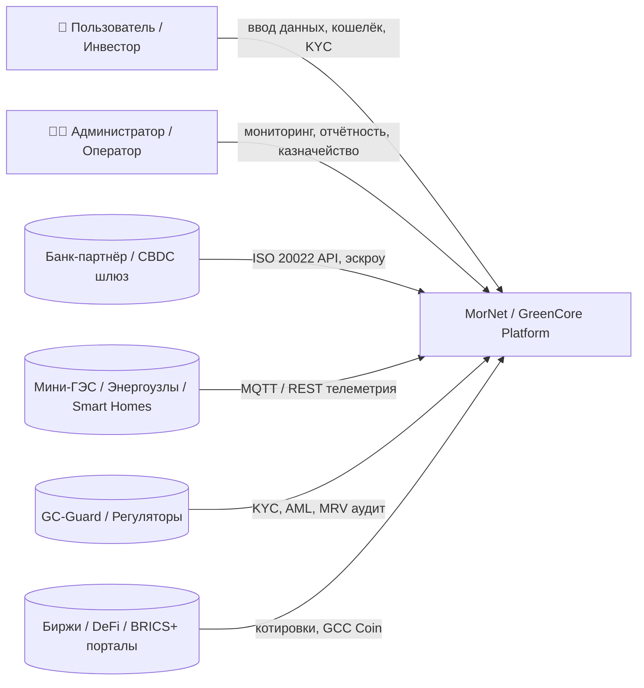
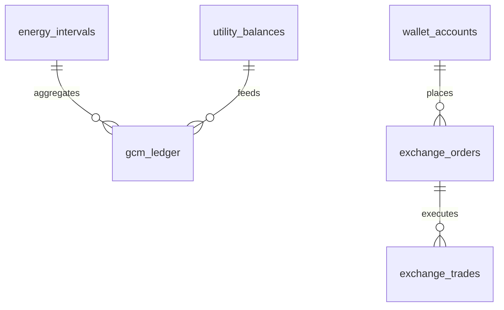

# c4_architecture_mornet_greencore_v1.0

**Дата:** 15.10.2025

**Автор:** Lead Architect

**Назначение:** визуальное и текстовое представление архитектуры MorNet / GreenCore в нотации C4 для интеграции с GitLab Pages / Notion / Figma.

---

## Level 1 — Context Diagram



**Задача:** показать границы системы, пользователей и внешние взаимодействия.

---

## Level 2 — Container Diagram

```mermaid
flowchart TB
  subgraph Frontend
    A1[Admin UI (Vue3 + Naive UI)]
    A2[Public UI (React + Next.js)]
  end

  subgraph Backend
    B1[API Gateway (NestJS/Fastify)]
    B2[Identity Service]
    B3[Wallet Service]
    B4[Token Engine / Telemetry]
    B5[Treasury DAO]
    B6[Exchange Router]
    B7[Bank Gateway (ISO 20022)]
    B8[GC-Guard Adapter]
  end

  subgraph Data
    D1[(PostgreSQL + TimescaleDB)]
    D2[(Redis Cache)]
    D3[(WORM Audit Storage)]
  end

  subgraph Blockchain
    C1[Smart Contracts (E/H/W/GCM ERC1155/20)]
    C2[Oracle Service]
  end

  subgraph Edge
    E1[Edge Agent (Linux ARM64, MQTT)]
  end

  A1 & A2 --> B1
  B1 --> B2 & B3 & B4 & B5 & B6 & B7 & B8
  B4 --> D1 & C2
  C2 --> C1
  B5 --> C1
  B6 --> B7
  E1 --> B4
  B8 --> D3

```

**Цель:** отразить контейнеры, технологии и связи между фронтами, сервисами и хранилищами.

---

## Level 3 — Component Diagram (пример: Token Engine)

```mermaid
flowchart TB
  subgraph Token Engine (NestJS)
    TE1[Telemetry Collector (MQTT listener)]
    TE2[Energy Calculator (E_netWh)]
    TE3[Oracle Signer (anti-duplicate)]
    TE4[Mint Dispatcher (ERC-1155 batch)]
    TE5[Validator & QA marks]
  end
  EXT[(Electrostation Node)]
  DB[(TimescaleDB)]
  TE1 --> TE2 --> TE3 --> TE4 --> DB
  EXT --> TE1

```

**Роль:** визуализировать внутреннюю структуру ключевых модулей (Token Engine, Wallet, GC-Guard Adapter).

---

## Level 4 — Data / Code Diagram (ER Model)



**Пояснение:** ER-модель отражает связи между основными таблицами БД TimescaleDB и PostgreSQL.

---

## Documentation Structure

```
/docs/architecture/
 ├─ c4_context.mmd
 ├─ c4_containers.mmd
 ├─ c4_components_tokenengine.mmd
 ├─ c4_er_model.mmd
 └─ c4_index.md  # интерактивная навигация между диаграммами

```

---

## Implementation Roadmap

| Этап | Цель | Ответственный | Срок |
| --- | --- | --- | --- |
| 1 | Утвердить структуру C4 и добавить в /docs/architecture/ | Lead Architect | Окт 2025 |
| 2 | Подключить Mermaid-рендеринг на GitLab Pages | DevOps Lead | Ноя 2025 |
| 3 | Интегрировать переходы в Notion/Figma | UX Designer | Ноя 2025 |
| 4 | Создать аналогичные диаграммы для Wallet и DAO Treasury | Backend Team | Дек 2025 |

---

## Вывод

Проект MorNet / GreenCore полностью переведён в формат **C4 Model**, что обеспечивает:

- наглядное отображение всех потоков и ролей системы;
- прозрачность архитектуры для бизнес-, Dev- и Legal-команд;
- готовность к публикации на GitLab Pages / Confluence / Notion.

> Документ создан для /docs/architecture/
> 
> 
> Версия: `c4_architecture_mornet_greencore_v1.0`  ✅
>