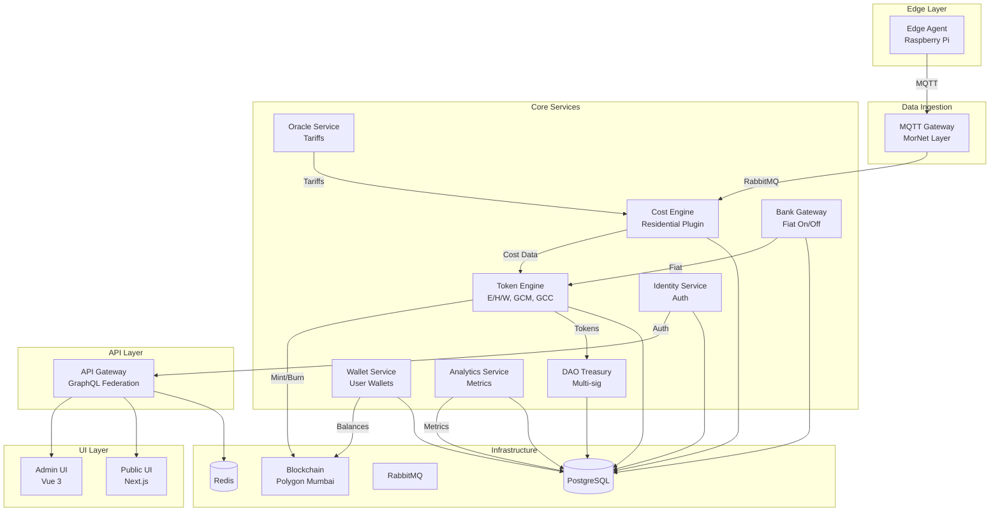

# Pre-Development Architecture Document: MorNet GreenCore MVP 1.0

**Дата:** 16 октября 2025  
**Версия:** 1.0  
**Статус:** Финальный архитектурный документ перед началом разработки  
**Цель:** Зафиксировать архитектуру MVP 1.0 для команды разработчиков

---

## 📋 Executive Summary

Этот документ описывает **финальную архитектуру MVP 1.0** проекта MorNet GreenCore перед началом активной разработки. Документ основан на решениях, зафиксированных в [Project Checkpoint](../analysis/2025-10-16_project-checkpoint.md) и [MVP Requirements Analysis](../analysis/mvp-requirements-analysis.md).

**Ключевые характеристики MVP 1.0:**

- **Scope:** Residential Sector (домохозяйства)
- **Tokens:** E/H/W (utility), GCM (index), GCC (coin)
- **Timeline:** Q1 2026 (12-16 недель разработки)
- **Team:** 8-10 человек
- **Budget:** $200-250K
- **Target:** 100+ домохозяйств, $10K MRR

---

## 🏗️ Архитектурный обзор

### High-Level Architecture

```
┌─────────────────────────────────────────────────────────────────┐
│                         MorNet GreenCore MVP 1.0                │
└─────────────────────────────────────────────────────────────────┘

┌──────────────┐         ┌──────────────┐         ┌──────────────┐
│  Edge Layer  │────────▶│  Core Layer  │────────▶│   UI Layer   │
└──────────────┘         └──────────────┘         └──────────────┘
     │                          │                        │
     │                          │                        │
     ▼                          ▼                        ▼
┌──────────────┐         ┌──────────────┐         ┌──────────────┐
│ Raspberry Pi │         │ Microservices│         │  Admin UI    │
│ Edge Agent   │         │   (NestJS)   │         │  (Vue 3)     │
│              │         │              │         │              │
│ Wi-Fi Sockets│         │ PostgreSQL   │         │  Public UI   │
│ MQTT Client  │         │ Redis        │         │  (Next.js)   │
│ SQLite       │         │ RabbitMQ     │         │              │
└──────────────┘         └──────────────┘         └──────────────┘
                                │
                                ▼
                         ┌──────────────┐
                         │  Blockchain  │
                         │  (Polygon)   │
                         │  Mumbai Test │
                         └──────────────┘
```

---

## 🎯 Scope MVP 1.0

### ✅ В scope:

**1. Сбор телеметрии:**
- Wi-Fi розетки (Tapo P110, Sonoff POW R3)
- MQTT протокол
- Локальное хранение (SQLite)

**2. Расчёт себестоимости:**
- Residential Plugin (E/H/W)
- Тарифы ЖКХ (вручную)
- Простые формулы (cost = consumption × tariff)

**3. Токенизация:**
- E/H/W utility tokens
- GCM index token
- GCC coin (fiat-backed)

**4. Fiat on/off-ramp:**
- Интеграция с 1 банком (Тинькофф или Модульбанк)
- ₽ → GCC (deposit)
- GCC → ₽ (withdrawal)

**5. UI:**
- Admin UI (управление системой)
- Public UI (дашборд пользователя)

### ❌ НЕ в scope:

- OAuth, SSO, 2FA
- KYC/AML (полная верификация)
- Rate limiting, DDoS protection
- Prometheus, Grafana, Jaeger
- Load balancing, auto-scaling
- Multi-chain, upgradeable contracts
- Mobile app, PWA
- Real-time updates (WebSocket)

---

## 📊 Микросервисная архитектура

### Microservices Overview



---

## 🔧 Детальная архитектура микросервисов

### 1. Edge Agent (Raspberry Pi)

**Назначение:** Сбор телеметрии с Wi-Fi розеток

**Технологии:**
- Python 3.11
- MQTT client (paho-mqtt)
- SQLite (локальное хранение)
- Tapo/Sonoff API

**Функции:**
- Подключение к Wi-Fi розеткам
- Чтение данных (мощность, энергия, напряжение, ток)
- Публикация в MQTT (каждую минуту)
- Локальное хранение (на случай потери связи)

**MQTT Topic:**
```
mornet/{household_id}/telemetry
```

**Payload (JSON):**
```json
{
  "household_id": "hh_001",
  "timestamp": "2025-10-16T12:00:00Z",
  "devices": [
    {
      "device_id": "socket_001",
      "type": "electricity",
      "power_w": 1500,
      "energy_kwh": 0.025,
      "voltage_v": 220,
      "current_a": 6.8
    },
    {
      "device_id": "water_meter_001",
      "type": "water",
      "flow_m3h": 0.5,
      "total_m3": 12.5
    }
  ]
}
```

**Deployment:**
- Raspberry Pi 4 (4GB RAM)
- Raspbian OS
- Systemd service (автозапуск)

---

### 2. MQTT Gateway (MorNet Layer)

**Назначение:** Приём телеметрии, нормализация, валидация

**Технологии:**
- NestJS
- MQTT client
- RabbitMQ client
- Zod (schema validation)

**Функции:**
- Подписка на MQTT topics (`mornet/+/telemetry`)
- Парсинг JSON payload
- Валидация (schema validation)
- Нормализация (приведение к единому формату)
- Публикация в RabbitMQ (для Cost Engine)

**RabbitMQ Queue:**
```
mornet.telemetry.normalized
```

**Normalized Payload:**
```json
{
  "household_id": "hh_001",
  "timestamp": "2025-10-16T12:00:00Z",
  "electricity_kwh": 0.025,
  "water_m3": 0.5,
  "gas_m3": 0.0
}
```

**API:**
- Нет внешнего API (внутренний сервис)

---

### 3. Oracle Service

**Назначение:** Хранение и предоставление тарифов ЖКХ

**Технологии:**
- NestJS
- PostgreSQL
- GraphQL

**Функции:**
- Хранение тарифов в БД
- API для получения тарифов
- Ручное обновление тарифов (через Admin UI)

**GraphQL Schema:**
```graphql
type Tariff {
  id: ID!
  region: String!
  type: TariffType!
  rate: Float!
  unit: String!
  valid_from: DateTime!
  valid_to: DateTime
}

enum TariffType {
  ELECTRICITY
  WATER
  GAS
  HEAT
}

type Query {
  tariffs(region: String!, types: [TariffType!]): [Tariff!]!
  tariff(id: ID!): Tariff
}

type Mutation {
  createTariff(input: CreateTariffInput!): Tariff!
  updateTariff(id: ID!, input: UpdateTariffInput!): Tariff!
  deleteTariff(id: ID!): Boolean!
}
```

**Database Schema:**
```sql
CREATE TABLE tariffs (
  id UUID PRIMARY KEY DEFAULT gen_random_uuid(),
  region VARCHAR(100) NOT NULL,
  type VARCHAR(20) NOT NULL,
  rate DECIMAL(10, 4) NOT NULL,
  unit VARCHAR(20) NOT NULL,
  valid_from TIMESTAMP NOT NULL,
  valid_to TIMESTAMP,
  created_at TIMESTAMP DEFAULT NOW(),
  updated_at TIMESTAMP DEFAULT NOW()
);

CREATE INDEX idx_tariffs_region_type ON tariffs(region, type);
```

---

### 4. Cost Engine

**Назначение:** Расчёт себестоимости потребления (E/H/W)

**Технологии:**
- NestJS
- PostgreSQL
- GraphQL

**Функции:**
- Residential Plugin (расчёт для домохозяйств)
- Формулы расчёта себестоимости
- API для расчёта
- Хранение расчётов в БД

**Формулы (Residential Plugin):**

```typescript
// Электричество
cost_e = energy_kwh × tariff_e

// Вода
cost_w = water_m3 × tariff_w

// Газ (если есть)
cost_g = gas_m3 × tariff_g

// Тепло (если есть)
cost_h = heat_kwh × tariff_h

// Итого
cost_total = cost_e + cost_w + cost_g + cost_h
```

**GraphQL Schema:**
```graphql
type CostCalculation {
  id: ID!
  household_id: String!
  timestamp: DateTime!
  electricity_cost: Float!
  water_cost: Float!
  gas_cost: Float!
  heat_cost: Float!
  total_cost: Float!
  currency: String!
}

type Query {
  costCalculations(
    household_id: String!
    from: DateTime!
    to: DateTime!
  ): [CostCalculation!]!
}

type Mutation {
  calculateCost(input: CalculateCostInput!): CostCalculation!
}

input CalculateCostInput {
  household_id: String!
  electricity_kwh: Float!
  water_m3: Float!
  gas_m3: Float
  heat_kwh: Float
}
```

**Database Schema:**
```sql
CREATE TABLE cost_calculations (
  id UUID PRIMARY KEY DEFAULT gen_random_uuid(),
  household_id VARCHAR(100) NOT NULL,
  timestamp TIMESTAMP NOT NULL,
  electricity_cost DECIMAL(10, 2) NOT NULL,
  water_cost DECIMAL(10, 2) NOT NULL,
  gas_cost DECIMAL(10, 2) DEFAULT 0,
  heat_cost DECIMAL(10, 2) DEFAULT 0,
  total_cost DECIMAL(10, 2) NOT NULL,
  currency VARCHAR(3) DEFAULT 'RUB',
  created_at TIMESTAMP DEFAULT NOW()
);

CREATE INDEX idx_cost_household_timestamp ON cost_calculations(household_id, timestamp);
```

**RabbitMQ Consumer:**
- Queue: `mornet.telemetry.normalized`
- Автоматический расчёт при получении телеметрии

---

### 5. Token Engine

**Назначение:** Токенизация потребления (E/H/W, GCM, GCC)

**Технологии:**
- NestJS
- Hardhat (smart contracts)
- Ethers.js
- PostgreSQL

**Функции:**
- E/H/W Token Module (эмиссия utility tokens)
- GCM Index Token (расчёт индекса)
- GCC Coin (эмиссия/сжигание)
- API для токенизации
- Интеграция с блокчейном (Polygon Mumbai)

**Токенизация (формулы):**

```typescript
// Utility Tokens (E/H/W)
e_tokens = electricity_kwh
w_tokens = water_m3
h_tokens = heat_kwh

// GCM Index Token
GCM = cost_total / GCM_rate
// где GCM_rate = 8.4 ₽/GCM (из документа v1.5.0)

// GCC Coin
// Mint: при fiat deposit
gcc_minted = fiat_amount / gcc_rate
// где gcc_rate = 1 GCC = 1 ₽ (для MVP)

// Burn: при fiat withdrawal
fiat_amount = gcc_burned × gcc_rate
```

**GraphQL Schema:**
```graphql
type Token {
  id: ID!
  type: TokenType!
  symbol: String!
  name: String!
  contract_address: String!
  decimals: Int!
}

enum TokenType {
  UTILITY  # E, H, W
  INDEX    # GCM
  COIN     # GCC
}

type TokenBalance {
  user_id: String!
  token: Token!
  balance: Float!
}

type TokenTransaction {
  id: ID!
  from: String!
  to: String!
  token: Token!
  amount: Float!
  tx_hash: String!
  timestamp: DateTime!
  status: TransactionStatus!
}

enum TransactionStatus {
  PENDING
  CONFIRMED
  FAILED
}

type Query {
  tokens: [Token!]!
  tokenBalance(user_id: String!, token_id: ID!): TokenBalance
  tokenTransactions(user_id: String!): [TokenTransaction!]!
}

type Mutation {
  mintUtilityTokens(input: MintUtilityTokensInput!): TokenTransaction!
  mintGCM(input: MintGCMInput!): TokenTransaction!
  mintGCC(input: MintGCCInput!): TokenTransaction!
  burnGCC(input: BurnGCCInput!): TokenTransaction!
  transferTokens(input: TransferTokensInput!): TokenTransaction!
}
```

**Smart Contracts (Solidity):**

```solidity
// E Token (Utility Token)
contract EToken is ERC20 {
    address public minter;

    constructor() ERC20("Electricity Token", "E") {
        minter = msg.sender;
    }

    function mint(address to, uint256 amount) external {
        require(msg.sender == minter, "Only minter");
        _mint(to, amount);
    }
}

// GCM Token (Index Token)
contract GCMToken is ERC20 {
    address public minter;

    constructor() ERC20("GreenCore Metric", "GCM") {
        minter = msg.sender;
    }

    function mint(address to, uint256 amount) external {
        require(msg.sender == minter, "Only minter");
        _mint(to, amount);
    }
}

// GCC Coin (Fiat-backed)
contract GCCCoin is ERC20 {
    address public minter;

    constructor() ERC20("GreenCore Coin", "GCC") {
        minter = msg.sender;
    }

    function mint(address to, uint256 amount) external {
        require(msg.sender == minter, "Only minter");
        _mint(to, amount);
    }

    function burn(uint256 amount) external {
        _burn(msg.sender, amount);
    }
}
```

**Deployment:**
- Network: Polygon Mumbai Testnet
- Deployer: Hardhat
- Minter: Backend wallet (controlled by Token Engine)

---

### 6. DAO Treasury

**Назначение:** Хранение токенов, базовое governance

**Технологии:**
- NestJS
- Hardhat (smart contracts)
- Ethers.js
- PostgreSQL

**Функции:**
- Multi-sig wallet (2-of-3 или 3-of-5)
- Хранение GCC, E/H/W tokens
- Базовое governance (голосование за предложения)
- API для treasury операций

**GraphQL Schema:**
```graphql
type Treasury {
  id: ID!
  address: String!
  balances: [TokenBalance!]!
}

type Proposal {
  id: ID!
  title: String!
  description: String!
  proposer: String!
  votes_for: Int!
  votes_against: Int!
  status: ProposalStatus!
  created_at: DateTime!
  voting_ends_at: DateTime!
}

enum ProposalStatus {
  ACTIVE
  PASSED
  REJECTED
  EXECUTED
}

type Query {
  treasury: Treasury!
  proposals: [Proposal!]!
  proposal(id: ID!): Proposal
}

type Mutation {
  createProposal(input: CreateProposalInput!): Proposal!
  vote(proposal_id: ID!, vote: Boolean!): Proposal!
  executeProposal(proposal_id: ID!): Proposal!
}
```

**Smart Contract (Multi-sig):**

```solidity
contract DAOTreasury {
    address[] public owners;
    uint256 public required;

    struct Proposal {
        address to;
        uint256 value;
        bytes data;
        bool executed;
        uint256 confirmations;
    }

    mapping(uint256 => Proposal) public proposals;
    mapping(uint256 => mapping(address => bool)) public confirmations;
    uint256 public proposalCount;

    constructor(address[] memory _owners, uint256 _required) {
        owners = _owners;
        required = _required;
    }

    function submitProposal(address to, uint256 value, bytes memory data) external {
        require(isOwner(msg.sender), "Not owner");
        proposals[proposalCount] = Proposal(to, value, data, false, 0);
        proposalCount++;
    }

    function confirmProposal(uint256 proposalId) external {
        require(isOwner(msg.sender), "Not owner");
        require(!confirmations[proposalId][msg.sender], "Already confirmed");
        confirmations[proposalId][msg.sender] = true;
        proposals[proposalId].confirmations++;

        if (proposals[proposalId].confirmations >= required) {
            executeProposal(proposalId);
        }
    }

    function executeProposal(uint256 proposalId) internal {
        Proposal storage proposal = proposals[proposalId];
        require(!proposal.executed, "Already executed");
        proposal.executed = true;
        (bool success, ) = proposal.to.call{value: proposal.value}(proposal.data);
        require(success, "Execution failed");
    }

    function isOwner(address account) public view returns (bool) {
        for (uint256 i = 0; i < owners.length; i++) {
            if (owners[i] == account) return true;
        }
        return false;
    }
}
```

---

### 7. Wallet Service

**Назначение:** Управление кошельками пользователей

**Технологии:**
- NestJS
- Ethers.js
- PostgreSQL (зашифрованные ключи)

**Функции:**
- Создание кошелька (при регистрации)
- Хранение приватных ключей (зашифрованно)
- Баланс токенов (E/H/W, GCM, GCC)
- Отправка/получение токенов
- История транзакций

**GraphQL Schema:**
```graphql
type Wallet {
  id: ID!
  user_id: String!
  address: String!
  balances: [TokenBalance!]!
  created_at: DateTime!
}

type Query {
  wallet(user_id: String!): Wallet
  walletTransactions(user_id: String!): [TokenTransaction!]!
}

type Mutation {
  createWallet(user_id: String!): Wallet!
  sendTokens(input: SendTokensInput!): TokenTransaction!
}

input SendTokensInput {
  from_user_id: String!
  to_address: String!
  token_id: ID!
  amount: Float!
}
```

**Database Schema:**
```sql
CREATE TABLE wallets (
  id UUID PRIMARY KEY DEFAULT gen_random_uuid(),
  user_id VARCHAR(100) UNIQUE NOT NULL,
  address VARCHAR(42) UNIQUE NOT NULL,
  encrypted_private_key TEXT NOT NULL,
  created_at TIMESTAMP DEFAULT NOW()
);

CREATE INDEX idx_wallets_user_id ON wallets(user_id);
CREATE INDEX idx_wallets_address ON wallets(address);
```

**Encryption:**
- AES-256-GCM
- Key: хранится в переменной окружения (AWS Secrets Manager в production)

---

### 8. Bank Gateway

**Назначение:** Fiat on/off-ramp (₽ ↔ GCC)

**Технологии:**
- NestJS
- Bank API (REST)
- PostgreSQL

**Функции:**
- Интеграция с 1 банком (Тинькофф или Модульбанк)
- Fiat deposit (₽ → GCC)
- Fiat withdrawal (GCC → ₽)
- Escrow account (резервирование средств)

**Fiat Deposit Flow:**

```
1. User → Bank Gateway: POST /deposit/initiate
2. Bank Gateway → Bank API: Create virtual account
3. Bank API → Bank Gateway: Virtual account number
4. Bank Gateway → User: Virtual account number
5. User → Bank: Transfer fiat to virtual account
6. Bank → Bank Gateway: Webhook (payment.received)
7. Bank Gateway → Token Engine: Mint GCC
8. Token Engine → Blockchain: Mint GCC tokens
9. Blockchain → Token Engine: Tx hash
10. Token Engine → Bank Gateway: GCC minted
11. Bank Gateway → User: Deposit completed
```

**Fiat Withdrawal Flow:**

```
1. User → Bank Gateway: POST /withdrawal/initiate
2. Bank Gateway → Token Engine: Burn GCC
3. Token Engine → Blockchain: Burn GCC tokens
4. Blockchain → Token Engine: Tx hash
5. Token Engine → Bank Gateway: GCC burned
6. Bank Gateway → Bank API: Transfer fiat to user
7. Bank API → Bank Gateway: Transfer completed
8. Bank Gateway → User: Withdrawal completed
```

**GraphQL Schema:**
```graphql
type FiatTransaction {
  id: ID!
  user_id: String!
  type: FiatTransactionType!
  amount: Float!
  currency: String!
  status: FiatTransactionStatus!
  bank_tx_id: String
  gcc_tx_hash: String
  created_at: DateTime!
  completed_at: DateTime
}

enum FiatTransactionType {
  DEPOSIT
  WITHDRAWAL
}

enum FiatTransactionStatus {
  INITIATED
  PENDING
  COMPLETED
  FAILED
}

type Query {
  fiatTransactions(user_id: String!): [FiatTransaction!]!
  fiatTransaction(id: ID!): FiatTransaction
}

type Mutation {
  initiateDeposit(user_id: String!, amount: Float!): FiatTransaction!
  initiateWithdrawal(user_id: String!, amount: Float!): FiatTransaction!
}
```

**Database Schema:**
```sql
CREATE TABLE fiat_transactions (
  id UUID PRIMARY KEY DEFAULT gen_random_uuid(),
  user_id VARCHAR(100) NOT NULL,
  type VARCHAR(20) NOT NULL,
  amount DECIMAL(10, 2) NOT NULL,
  currency VARCHAR(3) DEFAULT 'RUB',
  status VARCHAR(20) NOT NULL,
  bank_tx_id VARCHAR(100),
  gcc_tx_hash VARCHAR(66),
  created_at TIMESTAMP DEFAULT NOW(),
  completed_at TIMESTAMP
);

CREATE INDEX idx_fiat_transactions_user_id ON fiat_transactions(user_id);
```

---

### 9. Identity Service

**Назначение:** Регистрация, логин, базовая авторизация

**Технологии:**
- NestJS
- JWT
- PostgreSQL
- bcrypt (хеширование паролей)

**Функции:**
- Регистрация (email + password)
- Логин (JWT tokens)
- Базовая авторизация (RBAC: user, admin)
- Профиль пользователя

**GraphQL Schema:**
```graphql
type User {
  id: ID!
  email: String!
  role: UserRole!
  profile: UserProfile
  created_at: DateTime!
}

enum UserRole {
  USER
  ADMIN
}

type UserProfile {
  first_name: String
  last_name: String
  phone: String
}

type AuthPayload {
  access_token: String!
  refresh_token: String!
  user: User!
}

type Query {
  me: User
  user(id: ID!): User
  users: [User!]!
}

type Mutation {
  register(input: RegisterInput!): AuthPayload!
  login(input: LoginInput!): AuthPayload!
  refreshToken(refresh_token: String!): AuthPayload!
  updateProfile(input: UpdateProfileInput!): User!
}

input RegisterInput {
  email: String!
  password: String!
}

input LoginInput {
  email: String!
  password: String!
}
```

**Database Schema:**
```sql
CREATE TABLE users (
  id UUID PRIMARY KEY DEFAULT gen_random_uuid(),
  email VARCHAR(255) UNIQUE NOT NULL,
  password_hash VARCHAR(255) NOT NULL,
  role VARCHAR(20) DEFAULT 'USER',
  created_at TIMESTAMP DEFAULT NOW(),
  updated_at TIMESTAMP DEFAULT NOW()
);

CREATE TABLE user_profiles (
  user_id UUID PRIMARY KEY REFERENCES users(id) ON DELETE CASCADE,
  first_name VARCHAR(100),
  last_name VARCHAR(100),
  phone VARCHAR(20),
  updated_at TIMESTAMP DEFAULT NOW()
);

CREATE INDEX idx_users_email ON users(email);
```

**JWT Tokens:**
- Access token: 15 minutes
- Refresh token: 7 days

---

### 10. API Gateway

**Назначение:** Единая точка входа, роутинг запросов

**Технологии:**
- NestJS
- Apollo Federation
- JWT

**Функции:**
- GraphQL Federation (объединение микросервисов)
- Базовая авторизация (JWT validation)
- Роутинг к микросервисам

**Federated Services:**
1. Identity Service
2. Wallet Service
3. Token Engine
4. DAO Treasury
5. Bank Gateway
6. Oracle Service
7. Cost Engine
8. Analytics Service

**GraphQL Gateway Schema:**
```graphql
# Объединение всех subgraph schemas
extend type User @key(fields: "id") {
  wallet: Wallet
  tokenBalances: [TokenBalance!]!
  fiatTransactions: [FiatTransaction!]!
}

extend type Wallet @key(fields: "id") {
  user: User!
}

# ... и т.д. для всех сервисов
```

---

### 11. Analytics Service

**Назначение:** Базовые метрики и дашборды

**Технологии:**
- NestJS
- PostgreSQL (агрегация данных)
- GraphQL

**Функции:**
- Метрики (пользователи, домохозяйства, потребление, GCC, транзакции)
- Простой дашборд (Admin UI)

**GraphQL Schema:**
```graphql
type Metrics {
  total_users: Int!
  total_households: Int!
  total_consumption: ConsumptionMetrics!
  total_gcc_supply: Float!
  total_transactions: Int!
}

type ConsumptionMetrics {
  electricity_kwh: Float!
  water_m3: Float!
  gas_m3: Float!
}

type Query {
  metrics: Metrics!
  userGrowth(from: DateTime!, to: DateTime!): [DataPoint!]!
  consumptionTrend(from: DateTime!, to: DateTime!): [DataPoint!]!
}

type DataPoint {
  timestamp: DateTime!
  value: Float!
}
```

---

### 12. Admin UI

**Назначение:** Управление системой (для администраторов)

**Технологии:**
- Vue 3 + Vite
- Pinia (state management)
- TailwindCSS
- GraphQL (Apollo Client)

**Функции:**
- Логин (admin)
- Управление пользователями (список, блокировка)
- Управление домохозяйствами (список, статус)
- Управление тарифами (добавление, редактирование)
- Дашборд (метрики)
- Логи (просмотр последних событий)

**Страницы:**
1. `/login` - Логин
2. `/dashboard` - Дашборд (метрики)
3. `/users` - Управление пользователями
4. `/households` - Управление домохозяйствами
5. `/tariffs` - Управление тарифами
6. `/transactions` - История транзакций
7. `/logs` - Логи системы

---

### 13. Public UI

**Назначение:** Интерфейс для пользователей (домовладельцев)

**Технологии:**
- Next.js 14 (React)
- TypeScript
- TailwindCSS
- GraphQL (Apollo Client)

**Функции:**
- Регистрация / Логин
- Профиль (редактирование)
- Подключение домохозяйства (добавление Edge Agent)
- Дашборд (потребление, баланс токенов, история)
- Fiat deposit/withdrawal (через Bank Gateway)
- Покупка/продажа токенов (E/H/W ↔ GCC)

**Страницы:**
1. `/` - Главная (лендинг)
2. `/register` - Регистрация
3. `/login` - Логин
4. `/dashboard` - Дашборд пользователя
5. `/profile` - Профиль
6. `/household` - Управление домохозяйством
7. `/wallet` - Кошелёк (баланс, транзакции)
8. `/deposit` - Fiat deposit
9. `/withdrawal` - Fiat withdrawal
10. `/exchange` - Обмен токенов

---

## 🗄️ Database Schema (PostgreSQL)

### Entity Relationship Diagram

```
users (1) ──< (1) user_profiles
  │
  │ (1)
  │
  ├──< (1) wallets
  │      │
  │      │ (1)
  │      │
  │      └──< (*) token_transactions
  │
  │ (1)
  │
  ├──< (*) fiat_transactions
  │
  │ (1)
  │
  └──< (*) households
         │
         │ (1)
         │
         └──< (*) cost_calculations

tariffs (*) ──> (1) cost_calculations

tokens (*) ──> (*) token_transactions
```

### Tables Summary

| Table | Rows (MVP) | Size (MVP) |
|-------|------------|------------|
| users | 100-200 | < 1 MB |
| user_profiles | 100-200 | < 1 MB |
| wallets | 100-200 | < 1 MB |
| households | 100-200 | < 1 MB |
| tariffs | 10-20 | < 1 MB |
| cost_calculations | 10K-50K | 10-50 MB |
| token_transactions | 1K-10K | 1-10 MB |
| fiat_transactions | 500-2K | < 1 MB |
| tokens | 10-20 | < 1 MB |
| **TOTAL** | **~12K-62K** | **~15-65 MB** |

---

## 🔐 Security (MVP)

### ✅ В scope MVP:

1. **Authentication:**
   - JWT tokens (access + refresh)
   - Password hashing (bcrypt)

2. **Authorization:**
   - RBAC (user, admin)
   - JWT validation в API Gateway

3. **Data Protection:**
   - HTTPS (TLS/SSL)
   - Encrypted private keys (AES-256-GCM)
   - Environment variables для secrets

4. **Input Validation:**
   - Zod schema validation
   - SQL injection protection (Prisma ORM)

### ❌ НЕ в scope MVP:

- OAuth, SSO, 2FA
- Rate limiting, DDoS protection
- WAF (Web Application Firewall)
- Intrusion detection
- Audit trails (детальное логирование)

---

## 📊 Infrastructure (MVP)

### Development Environment:

```yaml
# docker-compose.yml
version: '3.8'

services:
  postgres:
    image: postgres:15
    environment:
      POSTGRES_DB: mornet_dev
      POSTGRES_USER: mornet
      POSTGRES_PASSWORD: mornet_dev_pass
    ports:
      - "5432:5432"

  redis:
    image: redis:7
    ports:
      - "6379:6379"

  rabbitmq:
    image: rabbitmq:3-management
    ports:
      - "5672:5672"
      - "15672:15672"

  mosquitto:
    image: eclipse-mosquitto:2
    ports:
      - "1883:1883"
      - "9001:9001"
```

### Staging Environment:

- **Cloud:** AWS or Yandex Cloud
- **Kubernetes:** EKS or Yandex Managed Kubernetes
- **Database:** RDS PostgreSQL or Yandex Managed PostgreSQL
- **Cache:** ElastiCache Redis or Yandex Managed Redis
- **Message Queue:** Amazon MQ or Yandex Message Queue

### Production Environment:

- Отложено до после MVP (Q2 2026)

---

## 🚀 Deployment Strategy (MVP)

### GitLab CI/CD Pipeline:

```yaml
# .gitlab-ci.yml
stages:
  - build
  - test
  - deploy

build:
  stage: build
  script:
    - pnpm install
    - pnpm build

test:
  stage: test
  script:
    - pnpm test

deploy_staging:
  stage: deploy
  only:
    - develop
  script:
    - kubectl apply -f infra/kubernetes/staging/

deploy_production:
  stage: deploy
  only:
    - main
  when: manual
  script:
    - kubectl apply -f infra/kubernetes/production/
```

---

## 📅 Development Roadmap (MVP 1.0)

### Фаза 1: Foundation (Недели 1-4)

**Команда:**
- Backend: 4-5 разработчиков
- Frontend: 2-3 разработчика
- DevOps: 1 инженер
- Blockchain: 1 разработчик

**Задачи:**

**Backend:**
1. Identity Service (1-2 недели)
2. API Gateway (1-2 недели)
3. Wallet Service (2 недели)
4. Oracle Service (1 неделя)

**Frontend:**
5. Настройка проектов (Admin UI, Public UI)
6. Базовая авторизация (логин/регистрация)

**DevOps:**
7. Docker Compose (локальная разработка)
8. GitLab CI/CD (базовые pipelines)

**Blockchain:**
9. Smart contracts (E/H/W tokens, GCM, GCC)
10. Деплой на Mumbai testnet

**Deliverables:**
- ✅ Регистрация/логин работает
- ✅ API Gateway объединяет сервисы
- ✅ Кошельки создаются при регистрации
- ✅ Тарифы можно добавлять через Admin UI
- ✅ Smart contracts задеплоены на Mumbai

---

### Фаза 2: Core Logic (Недели 5-8)

**Задачи:**

**Backend:**
1. MQTT Gateway (2 недели)
2. Cost Engine (2-3 недели)
3. Token Engine (3-4 недели)

**Frontend:**
4. Admin UI: дашборд, управление тарифами
5. Public UI: дашборд, баланс токенов

**IoT:**
6. Edge Agent (2-3 недели)

**Deliverables:**
- ✅ Edge Agent собирает телеметрию
- ✅ MQTT Gateway принимает данные
- ✅ Cost Engine рассчитывает себестоимость
- ✅ Token Engine эмитирует токены
- ✅ Пользователь видит баланс токенов в UI

---

### Фаза 3: Banking & Treasury (Недели 9-12)

**Задачи:**

**Backend:**
1. Bank Gateway (3-4 недели)
2. DAO Treasury (2-3 недели)
3. Analytics Service (1-2 недели)

**Frontend:**
4. Admin UI: управление пользователями, логи
5. Public UI: fiat deposit/withdrawal, покупка/продажа токенов

**Deliverables:**
- ✅ Fiat deposit работает (₽ → GCC)
- ✅ Fiat withdrawal работает (GCC → ₽)
- ✅ DAO Treasury хранит токены
- ✅ Пользователь может купить/продать токены
- ✅ Admin видит метрики в дашборде

---

### Фаза 4: Integration & Testing (Недели 13-16)

**Задачи:**

**Backend:**
1. Интеграция всех сервисов
2. Unit tests (Jest)
3. Integration tests (Supertest)

**Frontend:**
4. E2E tests (Cypress)
5. UI/UX полировка

**DevOps:**
6. Staging environment (Kubernetes)
7. Мониторинг (базовый: logs, errors)

**Пилот:**
8. 10 домохозяйств
9. Сбор обратной связи

**Deliverables:**
- ✅ Все сервисы интегрированы
- ✅ Tests coverage > 70%
- ✅ Staging environment работает
- ✅ Пилот запущен (10 домохозяйств)

---

### Конец Q1 2026: 🚀 Запуск MVP 1.0

**Target:**
- 100+ домохозяйств
- $10K MRR
- 1,000+ GCC в обращении

---

## 📝 Definition of Done (DoD)

### Для каждого микросервиса:

1. ✅ Код написан и прошёл code review
2. ✅ Unit tests написаны (coverage > 70%)
3. ✅ Integration tests написаны
4. ✅ GraphQL schema документирован
5. ✅ API протестирован (Postman/Insomnia)
6. ✅ Dockerfile создан
7. ✅ Kubernetes manifests созданы
8. ✅ CI/CD pipeline настроен
9. ✅ Задеплоен на staging
10. ✅ Протестирован на staging

### Для MVP 1.0:

1. ✅ Все микросервисы готовы (DoD выполнен)
2. ✅ Frontend готов (Admin UI + Public UI)
3. ✅ E2E tests написаны и проходят
4. ✅ Staging environment работает стабильно
5. ✅ Пилот запущен (10 домохозяйств)
6. ✅ Обратная связь собрана и проанализирована
7. ✅ Критические баги исправлены
8. ✅ Документация обновлена
9. ✅ Production environment готов
10. ✅ Запуск одобрен командой

---

## 🎯 Success Metrics (MVP 1.0)

### Технические метрики:

| Метрика | Target |
|---------|--------|
| **Uptime** | > 95% |
| **API Response Time** | < 500ms (p95) |
| **Error Rate** | < 1% |
| **Test Coverage** | > 70% |
| **Bug Rate** | < 5 bugs/week |

### Бизнес метрики:

| Метрика | Target |
|---------|--------|
| **Households** | 100+ |
| **Active Users** | 80+ |
| **MRR** | $10K+ |
| **GCC Supply** | 1,000+ |
| **Transactions** | 500+/month |
| **User Retention** | > 70% |

---

## 📚 Documentation

### Для разработчиков:

1. **README.md** - Главный README проекта
2. **CONTRIBUTING.md** - Гайд по контрибуции
3. **Architecture/** - Архитектурные документы
4. **API/** - API документация (GraphQL schemas)
5. **Guides/** - Руководства (Getting Started, Deployment)

### Для пользователей:

1. **User Guide** - Руководство пользователя (Public UI)
2. **Admin Guide** - Руководство администратора (Admin UI)
3. **FAQ** - Часто задаваемые вопросы

---

## 🔗 Связанные документы

- [Project Checkpoint](../analysis/2025-10-16_project-checkpoint.md)
- [MVP Requirements Analysis](../analysis/mvp-requirements-analysis.md)
- [Strategy C Architecture](./strategy-c-hybrid-architecture.md)
- [Repository Strategy Analysis](../analysis/repository-strategy-analysis.md)

---

**Дата:** 16 октября 2025  
**Версия:** 1.0  
**Автор:** AI Assistant + Project Team  
**Статус:** ✅ Готов к разработке

---

## ✅ Checklist перед началом разработки

### Команда:

- [ ] Backend разработчики (4-5) наняты
- [ ] Frontend разработчики (2-3) наняты
- [ ] Blockchain разработчик (1) нанят
- [ ] DevOps инженер (1) нанят

### Инфраструктура:

- [ ] GitLab настроен
- [ ] Docker Compose работает локально
- [ ] Staging environment готов (Kubernetes)
- [ ] PostgreSQL, Redis, RabbitMQ, MQTT настроены

### Банк-партнёр:

- [ ] Банк выбран (Тинькофф или Модульбанк)
- [ ] Договор подписан
- [ ] API документация изучена
- [ ] Тестовый доступ получен

### Blockchain:

- [ ] Polygon Mumbai testnet настроен
- [ ] Deployer wallet создан и пополнен (test MATIC)
- [ ] Hardhat настроен

### Документация:

- [ ] Этот документ прочитан всей командой
- [ ] Вопросы обсуждены и прояснены
- [ ] Roadmap согласован

### 🚀 Готовы к старту!

---

**Дата фиксации:** 16 октября 2025  
**Версия:** 1.0  
**Статус:** ✅ Финальный документ перед разработкой

